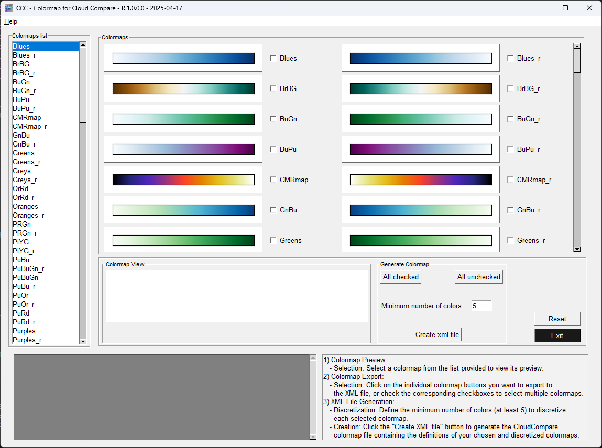
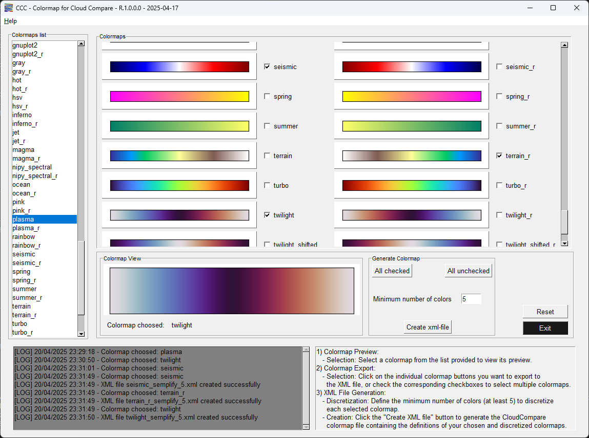

## CCC - Colormap for Cloud Comapre

<!-- PROJECT LOGO -->
 

    
<h3 align="center">Generate Python colormaps for Cloud Compare</h3>

 

    
    

 

There are two versions: 
- Python code, see the file py_Colormap_for_CloudCompare.py
- *.exe file, download from the bottom link

    
https://github.com/user-attachments/assets/1266bcbe-933c-4976-83bb-29060cad7e6d

## :wrench: Dependencies and Installation

- Python >= 3.9.21 (Recommend to use [Anaconda](https://www.anaconda.com/download/#linux) or [Miniconda](https://docs.conda.io/en/latest/miniconda.html))

### :computer: Requirements

- uuid
- matplotlib
- numpy

### ⬇️ Download executable file 

Here the link to download *.exe file
https://drive.google.com/file/d/1OUwilPWtCmc-kxL_BzwF8zaR5am4a5Gp/view?usp=sharing

<!-- CONTACT -->
## 🌐 Contact

  
  

 

<!-- Stats -->
## 🔥 My Stats

  

  

## :scroll: License
Copyright (C) 2025 Marco Intelisano

This program is free software: you can redistribute it and/or modify it under the terms of the GNU General Public License as published by the Free Software Foundation, either version 3 of the License, or any later version.

This program is distributed in the hope that it will be useful, but WITHOUT ANY WARRANTY; without even the implied warranty of MERCHANTABILITY or FITNESS FOR A PARTICULAR PURPOSE. See the GNU General Public License for more details.

You should have received a copy of the GNU General Public License along with this program. If not, see https://www.gnu.org/licenses/.
